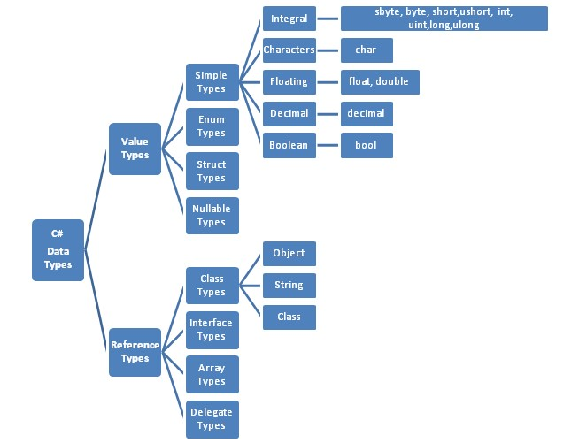

[Back to README](../README.md)

## Principais Tipos de Dados no .NET:
Os principais tipos de dados do C# são fundamentais para o desenvolvimento de aplicações, permitindo a escolha do tipo adequado para armazenar cada tipo de informação de forma eficiente.

No **C#**, os tipos de dados são categorizados em **tipos de valor** e **tipos de referência**. Uma variável do tipo de valor 
armazena diretamente uma instância do dado, enquanto uma variável do tipo de referência armazena um ponteiro para a instância.

Por padrão, ao passar um argumento para um método ou retornar um resultado, os valores das variáveis são copiados. No caso de tipos de valor, a instância inteira é copiada, garantindo que a modificação dentro do método não afete a variável original.

Para exemplificar, imagine um sistema de cadastro de pessoas. Ao cadastrar um usuário, precisamos armazenar seu nome e idade. O nome será armazenado em um tipo específico para texto, enquanto a idade será armazenada em um tipo numérico apropriado. Esses tipos de dados são essenciais para garantir a estrutura correta das informações, e é isso que exploraremos agora.

### Tipos de Valor
Armazenam dados diretamente e incluem:​

- **Tipos de Dados Numéricos**
Os tipos numéricos no C# são divididos em **números inteiros**, **números de ponto flutuante** e **números decimais**. 
Cada um tem seu próprio propósito e faixa de valores.

**Números Inteiros (Integral Types):** 
São usados para armazenar números sem casas decimais.
| Tipo   | Tamanho | Faixa de valores | Exemplo |
|--------|---------|------------------|---------|
|sbyte   | 8 bits	 | -128 a 127	      | sbyte idade = 25 |
|byte	   | 8 bits	 | 0 a 255	        | byte quantidade = 200 |
|short	 | 16 bits | -32.768 a 32.767	| short ano = 2024 |
|ushort	 | 16 bits |	0 a 65.535	    | ushort velocidade = 120 |
|int	   | 32 bits |	-2.147.483.648 a 2.147.483.647 | int populacao = 1500000 |
|uint	   | 32 bits |	0 a 4.294.967.295	| uint distancia = 300000 |
|long	   | 64 bits |	-9.223.372.036.854.775.808 a 9.223.372.036.854.775.807	| long galaxias = 1000000000000L |
|ulong	 | 64 bits |	0 a 18.446.744.073.709.551.615	| ulong estrelas = 900000000000000UL |

**Observação:** Use *int* na maioria dos casos, pois é o mais eficiente. Apenas utilize *long* ou *short* quando necessário. 

**Números de Ponto Flutuante (Floating-Point Types)** 
Armazenam números com casas decimais e são usados quando precisamos de valores **aproximados**, como cálculos científicos.
| Tipo   | Tamanho | Precisão | Exemplo |
|--------|---------|------------------|---------|
|float	 | 32 bits | 7 dígitos	      | float temperatura = 36.6f|
|double	 |64 bits  | 15-16 dígitos	  | double pi = 3.14159265359|

**Observação:** Prefira *double* na maioria dos casos, pois é mais preciso que *float*.  

**Tipo Decimal (Precision Numeric Type)**  
Projetado para cálculos financeiros e monetários, pois **evita erros de arredondamento**.
| Tipo   | Tamanho | Precisão | Exemplo |
|--------|---------|------------------|---------|
|decimal |128 bits | 28-29 dígitos	  | decimal preco = 99.99m|
**Quando usar?** 
- Para cálculos financeiros (*decimal* é mais preciso do que *double* e *float*).
- Quando for necessário armazenar números com alta precisão, como valores monetários.

**Resumo**  
- Use int para números inteiros.
- Use double para cálculos gerais com casas decimais.
- Use decimal para cálculos financeiros que exigem alta precisão.

- **Outros:**
| Tipo C# | Valor  |
|--------|--------|
|bool| verdadeiro ou falso|
|char| 16 bits, caractere Unicode|
|struct| estrutura definida pelo usuário|
|enum| enumeração|
  
**Tipos de Referência:** 
Armazenam referências a dados e incluem:​
| Tipo C# | Valor  |
|--------|--------|
|object| Tipo base de todos os tipos no .NET|
|string| Sequência de caracteres Unicode|​
|class e interfaces| definidas pelo usuário|
|Arrays|  |

**Novidades no .NET 9 Relacionadas a Tipos de Dados:**
Embora os tipos fundamentais não tenham mudado, o .NET 9 introduziu aprimoramentos e novos tipos para atender a demandas específicas:​

- *UUID v7* Uma nova versão de identificadores únicos universais que facilita a ordenação temporal, útil para bancos de dados que requerem ordenação por tempo de criação. ​

**Tipos de Tensor:** 
Para aplicações de inteligência artificial, foram introduzidos novos tipos de tensores, como *TensorPrimitives* e *Tensor<T>*, que permitem manipulação eficiente de dados multidimensionais. ​

Para uma compreensão mais aprofundada, recomendo consultar a documentação oficial da Microsoft sobre os tipos de dados no .NET e as novidades específicas do .NET 9.

 

  
  <a href="arithmetic-operators.md">Próxima: Operadores Aritiméticos .NET</a>

