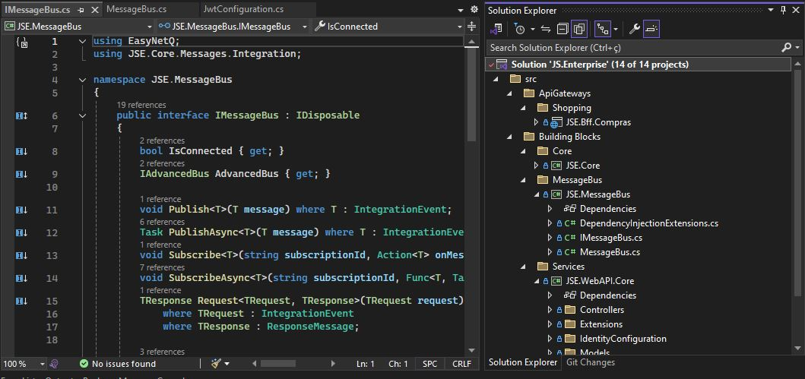

# Fundamentos do C#

## Aprenda desde os fundamentos até a criação de uma aplicação em C#

### Conceitos Básicos

#### O que é lógica de programação?
<p>Podemos resumir de forma bem simples, a lógica de programação é uma sequência de passos (**Algoritmo**) para executar algumas tarefas de um programa.<br />

**Exemplo de Algoritimo:** Chupar uma bala: <br /> 
1. Pegar a bala;
2. Desembalar a bala;
3. Colocar na boca;
4. Chupar a bala.

**Exemplo de lógica de programação:** Minha esposa diz: <br />
Vai até a padaria e compre um litro de leite, se lá tiver refrigerante traga três.<br/> 
Chegando na padaria, logo vi que havia refrigerante, então eu comprei três leites.<br/> 
Pareço ter feito confusão, mas existe uma condicional que cérebro de desenvolvedor entende,iremos ver operadores mais à frente em operadores e expressões.<br /> 

**Exemplo de operador condicional:**

```python
ComprarLeite()
{
    int quantidade = 1;
    bool temRefrigerante = true;

    if(temRefrigerante)
       quantidade = 3;
}
```

#### O que é linguagem de programação?
<p>Lógica de programação é uma forma de escrever instruções que o computador possa interpretar e executar todo o conjunto de intruções que escrevemos, é chamado de código fonte e esse código pode ser compilado ou interpretado
</p>

#### O que é o .NET?
<p>
  O **.NET** é uma plataforma de código aberto, ou seja roda no Windows, Linux e macOS, criada pela Microsoft para construção de diferentes tipos de aplicações, como por exemplo:
</p>


<p>
 A plataforma **.NET** fornece um conjunto de bibliotecas otimizadas para acelerar o desenvolvimento, além da possibilidade de desenvolver aplicações em diversas , como.  
</p>

- **C#**
- **F#**
- **Visual Basic**

**Isso é Interoperabilidade com .NET**
<p>
 O **COM** (Component Object Model) permite que um objeto exponha sua funcionalidade à outros componentes e aplicativos host em plataformas Windows. Para ajudar a permitir que os usuários executem a interoperação com as bases de código existente.
</p>

<p>
** A evolução do .NET**
</p>


<p>
 Para visualizar a timeline em alta resolução acesse: <br />
  <a href="https://time.graphics/pt/editor/291016" target="_blank">time.graphics</a>
</p>

<p>
 O .NET Framework foi criado em 2002, somente era possivel desenvolver aplicações para o Sistema Operacional Windows, em 2014 a Microsoft apresentou a primeira versão do .NET Core,  capaz de desenvolver aplicações para  Windows, Linux e macOS. Em 2020 a Microsoft reescreveu toda a plataforma alterando até o nome novamente para .NET para não gerar confusão entre as versçoes antigas.
</p>

#### O que é CLR?
<p>
 **CLR** Common Language Runtime é a base principal do .NET, sendo o responsável por executar sua aplicação e se comunicar com o Hardeware. <br/>
 Vamos entender como funciona o processo de compilação:
</p>

<p>Esse é um assunto bastante avançado, mas é de extrema importância abordar esse assunto, para que você possa compreender de fato como funciona a sua aplicação através do .NET, desde a compilação do código fonte até a execução da aplicação <br/> 

Durante a nossa evolução como desenvolvedor, iremos desenvolver habilidades para fazer um bom uso de harware, quando estamos escrevendo nosso código fonte, ou seja, conforme vamos desenvolvendo nossas habilidades vamos entendendo como podemos contruir códigos melhores para fazer um bom uso do harware e utilizar menos recursos da CPU e menos memória, com isso teremos uma aplicação muito mais performática.<br />

O CLR já é capaz de fazer um bom gerenciamento de memória de forma bem eficiente, você irá aprender mais adiante o que são variáveis e objetos. <br />

Para fazer uma pequena observação para você entender um pouco melhor sobre o que eu falei de gerenciamento de memória, imagine um cenário, onde você tem um cadastro de pessoas e você precisa, por exemplo carregar um determinado registro para exibir para o usuário final, então o CLR possui um conjunto de recursos, um deles é o GC Garbage Collector (Coletor de lixo) que faz o seguinte, quando ele entende que essa informação que você carregou para a memória não está mais sendo utilizada, automaticamente ele vai na memória e remove essa informação, liberando mais espaço na memória, então isso significa que em partes que ele assume a responsabilidade de otimizar os recursos que estão sendo utilizados na máquina.<br />

Agora vamos entender de fato como funciona o processo de compilação e execução. <br />
Então vamos analizar a seguinte imagem: <br />
</p>
 
 

<p>
 O primeiro passo é escrever a aplicação utilizando a linguagem de preferência. Quando queremos executar esse código, precisamos compilar a nossa aplicação, o compilador gera um assembly do tipo .exe ou uma .dll e isso vai depender da configuração do tipo de projeto que você criou, isso você vai aprender mais a frente.<br />

 Esse arquivo vai passar por um outro processo, o compilador pega o código fontee o transforma em uma outra linguagem IL (Linguagem Intermediária) essa linguagem intermediária foi criada para que o .NET fornecesse a capacidade de desenvolvermos em outras linguagens e que o core, o motor pricipal fosse capaz de ler apenas uma linguagem que é o IL então o compilador do C# vai gerar o código executável em uma .dll ou .exe, que contenha essas intruções em código IL, então ele transforma o código do C# para essa IL, e o que acontece é que em tempo de execução, ou seja, a hora que você vai executar a sua aplicação o .NET vai utilizar os recursos do CLR, é onde o CLR entra em ação de fato.<br />

 Mais um importante dos recursos do CLR, é o RyuJIT, um outro compilador em tempo de execução, que o compilador vai pegar esse código IL e transformar em um código nativo da máquina que você está utilizando e aí sim vai executar a sua aplicação.
 </p>

#### O que é um projeto?
<p>
Mais á frente iremos criar um projeto na prática. <br /> 
Esse módulo tem como objetivo fazer um pequeno overview do que é um projeto. Quando estamos criando nossas aplicações em .NET.<br />

Um projeto é uma forma de você organizar todo código fonte da sua aplicação, seja por arquivos
ou até mesmo por pastas, no projeto é onde fica todos os arquivos que serão compilados, além disso você pode adicionar informações sobre sua aplicação, como por exemplo o nome de sua aplicação, versão da sua aplicação, porque a cada alteração que você fizer no seu código fonte e compilar sua aplicação novamente voê pode querer gerar uma nova versão e é exatamente no projeto que você informa a versão. Você pode também informar a versão do .NET. Como a Microsoft tem evoluído bastante o .NET e tem lançado várias versões, é no projeto que você vai setar e informar qual é a versão do .NET que você irá utilizar no projeto. <br />
Basicamente é essa a estrutura de um projeto:
</p>


<p>
 Sendo assim, quando for compilar a nossa aplicação o compilador <a href="https://github.com/dotnet/roslyn">roslyn</a> irá analizar a estrutura do projeto e vai compilar a aplicação usando as configurações adicionas no arquivo do projeto. De forma resumida é isso, o projeto é utilizado para organizar a estrutura do código fonte da aplicação e configurar informações que são relevantes para a aplicação, mais a frete criaremos uma projeto totalmente do zero e você irá compreender melhor a estrutura de um projeto.
</p>

#### O que é uma Solition?
<p>
Apesar de o nome ser um pouco confuso (Solution ou Solução) não está relacionado a resolução de algum tipo de problema. Quando estamos desenvolvendo uma aplicação em .NET precisamos criar projetos para organizar o código fonte, conforme falado  no módulo anterior. <br/>

Uma Solution é uma forma de agrupar diversos projetos, e no momento de compilar a aplicação ao invés de você compilar projeto por projeto você compila a Solution e os binários de cada projeto serão gerados individualmente de uma única vez.<br/>
Basicamente é essa a estrutura de uma Solution:
</p>



<p>
 Um exemplo é quando você está desenvolvendo um ERP deve sere dividido em vários módulos, como por exemplo um módulo de cadastro, módulo financeito, módulo de compras, etc...<br />

 Então você cria uma Solution com o nome da aplicação.
</p>

<hr />

### Preparando o ambiente

1. Instalando o .NET SDK 
<p>
 Entre na página <a href="https://dot.net/">dot.net</a>, faça o download do SDK para seu Sistema Operacional. 
</p>

2. Conhecendo IDE's de desenvolvimento
<p>
Durante o ciclo de desenvolvimento de um Sofware você precisa de uma IDE 
(Integrated Development Environment ou Ambiente de Desenvolvimento Integrado). 
O objetivo principal da IDE é acelerar o desenvolvimento da sua aplicação, dado que nos fornece 
ferramentas como Intelicense (Um recurso que ajuda a preencher o código) para ajudar no processo de desenvolvimento do código. 
Você pode até utilizar o notepad para escrever seu código e compilar a sua aplicação em um prompt de comando,
mas as IDE1s são muito mais produtivas. <br />
Vamos conhecer três IDE's que são as mais utilizadas no mundo, quando falamos em desenvolvimento de Software.<br />
</p>


##### Visual Studio Code
<p>
 O Visual Studio Code é uma das IDE's mais utilizadas no mundo, isso porque a Microsoft teve
 como objetivo desenvolver essa IDE sendo multiplataforma, isso significa que você pode 
 utilizar tanto no Windows, Linux e macOS. É uma IDE open source, isso significa que é de código aberto,
 você pode ir até o github e fazer contribuições para o projeto, é multilinguagem e por isso você pode 
 utilizar para desenvolver em diversas linguagens de programação.
</p>

#### Visual Studio
<p>
Temos o VIsual Studio que para mim é a melhor IDE para desenvolvimento para .NET, porém existe
algumas limitações, por exemplo ele só pode ser instalado em Sistema Operacional Windows. Temos o
Visual Studio Free, que é o Community Only, isso significa que você pode utilizart ele de forma
Free, mas você nçao pode desenvolver Sistemas que são comerciais, aquele Sistema que você vai cobrar 
por ele. E temos as versões Professional e Enterprise, que são as versões de fato pagas.
</p>

#### Jetbrains Rider
<p>
Temos também uma outra excelente IDE que é da Jetbrains Rider, é uma IDE que é multiplataforma,
então você pode utilizar para desenvolver aplicações tanto no Windows, Linux e macOS, mas ela não é Free,
ou seja, você precisa adquirir uma licença dessa IDE.
</p>

#### Vamos utilizar o Vuisual Studio Code

<p>
 Após a instalação do Visual Studio code precisaremos:
</p>

 ##### Instalar uma extensão

 <p>
  Dado cenário que vamos trabalhar com a linguagem C#, utilizando essa IDE. Com o Visual Studio Code é 
  possível desenvolver em diversas linguagens de programação, mas para isso é necessário instalar 
  alguma extenção.<br />
  Iremos instalar a extenção C# oficial da Microsoft.
 </p>


### Hands-On-Code
<p>
 Este módulo tem como objetivo:
</p>

#### Criar uma Solution via CLI

<p>
 Para criar a nossa primeira Solution utilizando o .NET, o qual já foi apresentado em módulos primeiro você precisa escolher um diretório onde você quer criar esses arquivos.<br />
 Exemplo: C:\Projects\Curso<br />

 O .NET possui vários templates que podemos utilizar para criar uma Solution ou até mesmo um projeto ou bibliotecas. <br />

Abra um prompt de comando e navegue até o diretório criado.<br />
Digite o seguinte comando:
</p>

```bash
 C:\Projects\Curso>dotnet new list
```
<p>
Para exibir todos os templates disponíveis do .NET que podemos utilizar, conforme a imagem abaixo.
</p>


<p>
 O template que iremos utilizar é o Solution File, para isso digite:
</p>

```bash
 C:\Projects\Curso>dotnet new sln -n Curso
```
<p>
 Que é do template de **Solution File**, o argumento -n é para informar o nome do projeto ou da Solution, iremos nomear de Curso. <br/>
 Ao pressionar enter o .NET irá utilizar esse template de Solution e vai criar um arquivo de Solution. <br> 
 Navegue até o diretório selecionado e vai ver o arquivo Curso.sln criado.
</p>

#### Criar um projeto via CLI
<p>
Agora vamos criar um projeto que iremos utilizar para os próximos módulos.<br />
Para isso digite o comando:
</p>

```bash
 C:\Projects\Curso>dotnet new console -n ProjetoAulas -f net9.0
```
<p>
 E pressione Enter para criar esse projeto. o argumento -f é para informar qual a versão do .NET que iremos utilizar nesse projeto, nesse caso vamos utilizar o .NET 9.<br />
 Navegue até o diretório selecionado e vai ver o arquivo ProjetoAulas.csproj e o arquivo principal Program.cs criado.
</p>

#### Executar o primeiro projeto
<p>
 Esse módulo tem como objetivo executar a nossa primeira aplicação em .NET, nos módulos anteriores criamos a Solution Curso.sln e também criamos uma Projeto chamado ProjetoAulas.csproj.<br/>

 Em módulos anteriores explicamos o que uma Solution e sua principal funcionalidade, que é de organizar projetos que desenvolvemos em .NET. Como já criamos uma Solution e um projeto, o que precisamos fazer agora é adicionar o nosso Projeto na Solution.<br />

 Antes de adicionar o projeto na Solution vamos ao Prompt de comando e vamos analizar a estrutura do arquivo Curso.sln, que é a nossa Solution<br/>

 Digite no prompt de comando:
</p>

```bash
 C:\Projects\Curso>type Curso.sln
```
<p>
Basicamente essa é a a estrutura do arquivo da Solution Curso.sln
</p>


<p>
Então basicamente dentro desse arquivo, possui alguns código, que não precisamos editar manualmente, sempre iremos manipular esse arquivo dentro de uma IDE ou através do console utilizando o .NET. Esse arquivo não tem nenhuma informação de extrema importância até o momneto
dentro desse arquivo de Solution. Então agora vamos adicionar nosso projeto na Solution digitando o seguinte comando:
</p>   

```bash
 C:\Projects\Curso>dotnet sln Curso.sln add ProjetoAulas
```
<p>
 Agora o projeto foi adicionado na Solution, seu eu digitar novamente o comando:
</p>

```bash
 C:\Projects\Curso>type Curso.sln
```
<p>
 Agora foi adicionado algumas informações importantes dentro desse arquivo, a informação mais importante de se destacar é o ProjetoAulas que foi adicionado no arquivo Solution.
</p>


<p>
 Temos aqui o nome do projeto e temos o diretório do projeto onde se encontra o projeto dentro da Solution, então vamos entender a principal funcionalidade da Solution, que é organizar os projetos que estamos desenvolvendo a aplicação. Conforme vamos criando projetos e adicionando na Solution ele vai alterando o arquivo criando blocos de informações de cada projeto. <br/>

 Vamos conhecer agora alguns comando de extrema importancia que vamos utilizar durante o processo de nossa aplicação. <br />

 Para compilar o projeto temos duas opçoes, podemos compilar na raiz da minha Solution digitando um comando para compilar toda a Solution, como também eu posso digitar um comando 
 especifico para o projeto que eu quero compilar.   
</p>

```bash
 C:\Projects\Curso>dotnet build
```
<p>
Ao digitar esse comando ele vai analisar todos arquivos do projeto que estão dentro do arquivo
Solution e vai compilar e gerar os binários que contém a linguagem IL que já foi explicado em módulos anteriores que é a Linguagem Intermediária (IL) para que o runtime possa executar a nossa aplicação de fato. Então, ao digitar o comando dotnet build ele vai compilar o projeto.<br/>

Se você for até o diretório vai encontrar algumas pastas, uma pasta chamada obj que armazena objetos temporários em tempo de desenvolvimento, então enquanto você está desenvolvendo a sua aplicação alguns arquivos podem estar sendo gerados dentro dessa pasta obj. <br />

A pasta bin/debug/net9.0 que é a versão do framework que escolhemos é onde fica os arquivos 
da compilação do nosso projeto, quando executamos o comando dotnet build ele gera os binários, que nesses binários contém a Linguagem Intermediária (IL), que já falamos em módulos anteriores e é através desses arquivos que executamos a aplicação, esses arquivos são a nossa aplicação final. <br/>     

Um outro comando que vamos analisar é o comando clean. Observe o seguinte compilamos o projeto, ele gerou os binários na pasta debug e na pasta obj.<br/>

Se digitar o comando:
</p>

```bash
 C:\Projects\Curso>dotnet clean
```

<p>
 O comando irá limpar todos os arquivos que foram gerados em tempo de compilação.<br />
 Para executar o projeto digite o comando:    
</p>

```bash
 C:\Projects\Curso>dotnet run
```
<p>
O console vai informar que não foi possivel encontrar um projeto para executar, para executar  uma aplicação precisamos passar para o .NET qual é a aplicação que queremos executar, ela não vai ser executada automaticamente por estar na pasta da minha Solution. Nossa Solution é utilizada como uma forma apenas de organizar os projetos, mas para executar os projetos precisamos passar para o .NET qual é o projeto que queremos executar. <br/>

É preciso executar o comando:
</p>

```bash
 C:\Projects\Curso>dotnet run --project ProjetoAulas 
```
<p>
 É necessário informar o diretório do projeto para executar.<br /> 
 Essa é a primeira forma de executar o projeto na raiz da Solution informando o argumento --project e informar o diretório do projeto. <br/>   
</p>

<p>
A segunda opção para executar o projeto é navegar até o diretório onde está o projeto e executar o comando:    
</p>

```bash
 C:\Projects\Curso\ProjetoAulas>dotnet run
```
<p>
Assim não é preciso informar qual é o projeto porque automaticamente o .NET vai fazer o discover daquele diretório e vai encontrar o arquivo com a extensão .csproj e vai executar o projeto.     
<p>

#### O que são namespaces?
#### Tipos de dados do C#
#### O que é uma variável
#### O Que é uma constante
#### Comentários
#### Operadores aritiméticos
#### Operadores relacionais
#### Operadores lógicos
#### Operador ternário
